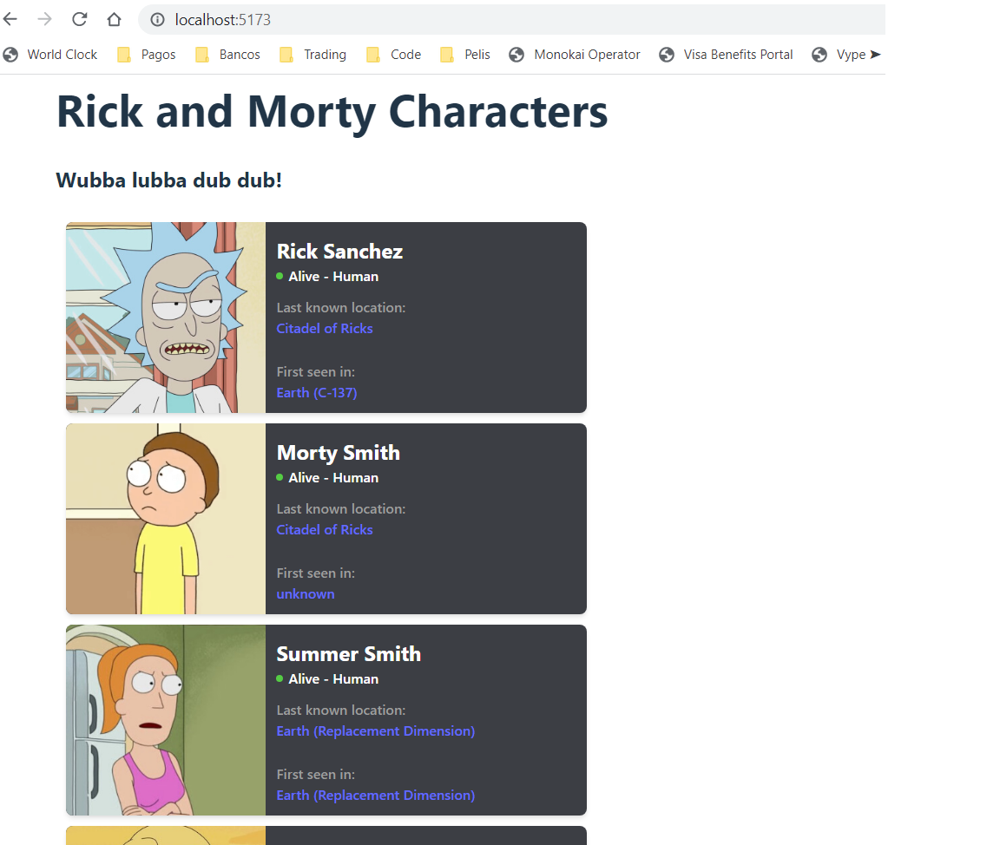

# Make It Real - Character Card Prop Types
## This is a solution to the *Character Card prop types* project of the Make It Real course.

## The challenge
create a Character Card and configure prop types using react

## Screenshot

## My process
### Built with
- Semantic markup using vscode editor
- React code using vite in vs code
- CSS properties in a stylesheet file
- Prop Types library

## What I learned
I learn and practice how to use prop types library

## Author
Juan David Peña  
github - @juandape  
email - juandavidp76@hotmail.com  

## Vercel page
()

## Acknowledgments
Thanks to Make it Real to show me a path to become a better programmer